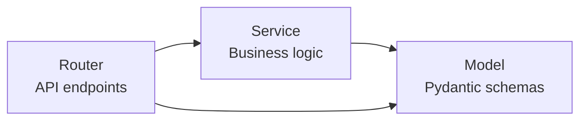
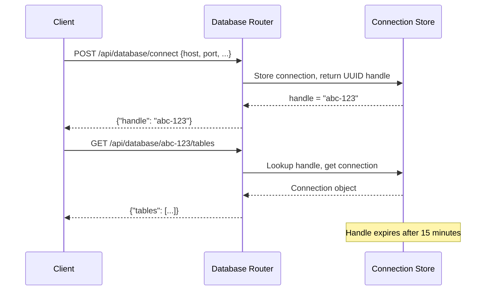

# Backend Architecture

The AXIS backend is a **FastAPI** application following a router / service / model layered architecture. It handles data ingestion, analytics computation, database integration, AI copilot features, and report generation.

## Application Entry Point

The FastAPI app is created in `backend/app/main.py` with:

- A `lifespan` async context manager for startup/shutdown events (DuckDB init, metadata loading, human signals rebuild, periodic sync scheduler)
- CORS middleware allowing the frontend origin
- All 14 routers mounted under `/api/` prefixes
- Health check endpoints at `/` and `/health`
- Background task management with graceful cancellation on shutdown

```python
# backend/app/main.py (simplified)
app = FastAPI(title="AXIS API", version="0.1.0", lifespan=lifespan)

app.add_middleware(
    CORSMiddleware,
    allow_origins=["http://localhost:3500", settings.FRONTEND_URL],
    allow_methods=["*"],
    allow_headers=["*"],
)

app.include_router(config.router,  prefix="/api/config",  tags=["config"])
app.include_router(data.router,    prefix="/api/data",    tags=["data"])
# ... 12 more routers
```

## Router / Service / Model Pattern



| Layer   | Location              | Responsibility                              |
|---------|-----------------------|---------------------------------------------|
| Router  | `app/routers/*.py`    | HTTP endpoint definitions, request validation, error mapping |
| Service | `app/services/*.py`   | Business logic, data transformations, external integrations |
| Model   | `app/models/*.py`     | Pydantic request/response schemas           |

!!! info "Thin routers"
    Routers should contain minimal logic. They validate input, call service functions, and map service exceptions to HTTP status codes.

## Routers

AXIS registers **14 routers** in `main.py`. Each handles a distinct domain:

| Router               | Prefix                          | Purpose                                       |
|----------------------|---------------------------------|-----------------------------------------------|
| `config`             | `/api/config`                   | Theme configuration, app settings             |
| `data`               | `/api/data`                     | CSV upload, example datasets, eval DB import  |
| `analytics`          | `/api/analytics`                | Summary stats, distribution, correlation, radar, scatter |
| `ai`                 | `/api/ai`                       | AI copilot chat, data analysis, status        |
| `align`              | `/api/align`                    | LLM judge alignment, prompt optimization      |
| `reports`            | `/api/reports`                  | Report generation, issue extraction           |
| `database`           | `/api/database`                 | PostgreSQL connection, schema browsing, import |
| `human-signals`      | `/api/human-signals`            | Human signals upload, DB import, signals processing |
| `monitoring`         | `/api/monitoring`               | Monitoring data upload, DB config, DB import  |
| `monitoring_analytics` | `/api/monitoring/analytics`   | Trends, latency distribution, metric breakdown, classification |
| `eval_runner`        | `/api/eval-runner`              | Run evaluations, SSE streaming progress       |
| `memory`             | `/api/memory`                   | Memory rule CRUD, upload, example data        |
| `graph`              | `/api/memory/graph`             | Knowledge graph queries, search, neighborhood |
| `store`              | `/api/store`                    | DuckDB sync triggers, status, metadata, paginated data |

## Services

| Service                     | File                            | Purpose                                       |
|-----------------------------|---------------------------------|-----------------------------------------------|
| `data_processor`            | `data_processor.py`             | Format detection, column normalization, data transformation |
| `database_service`          | `database_service.py`           | PostgreSQL operations (connect, query, import) |
| `connection_store`          | `connection_store.py`           | Ephemeral connection handle management (15-min TTL) |
| `issue_extractor_service`   | `issue_extractor_service.py`    | Extract issues from evaluation data, bridge to axion InsightExtractor for structured pattern discovery |
| `human_signals_service`     | `human_signals_service.py`      | Human signals data processing                 |
| `signals_display_config`    | `signals_display_config.py`     | YAML-driven display configuration for human signals dashboard |
| `memory_service`            | `memory_service.py`             | Memory rule management (CSV cache, CRUD)      |
| `graph_service`             | `graph_service.py`              | FalkorDB graph queries and traversal          |
| `eval_runner_service`       | `eval_runner_service.py`        | Evaluation execution with Axion metrics       |
| `align_service`             | `align_service.py`              | LLM judge evaluation, prompt optimization, and EvidencePipeline-based pattern discovery with learning insights |
| `axion_adapter`             | `axion_adapter.py`              | Adapter for internal Axion AI toolkit         |
| `duckdb_store`              | `duckdb_store.py`               | DuckDB connection manager, staging+swap, incremental append, watermarks, metadata persistence |
| `sync_engine`               | `sync_engine.py`                | Postgres -> DuckDB split sync (dataset+results), parallel COPY, incremental, periodic scheduler |

## Configuration

### Settings Class

The `Settings` class in `app/config.py` uses `pydantic-settings` to load configuration from environment variables and `.env` files:

```python
class Settings(BaseSettings):
    HOST: str = "127.0.0.1"
    PORT: int = 8500
    DEBUG: bool = True
    FRONTEND_URL: str = "http://localhost:3500"

    # AI Configuration
    openai_api_key: str | None = None
    anthropic_api_key: str | None = None
    llm_model_name: str = "gpt-4"

    # Database configurations (human_signals, monitoring, eval)
    human_signals_db_host: str | None = None
    monitoring_db_host: str | None = None
    eval_db_host: str | None = None

    # Graph database (FalkorDB)
    graph_db_host: str = "localhost"
    graph_db_port: int = 6379

    # Theme
    axis_theme_active: str | None = None

    model_config = SettingsConfigDict(env_file=".env", case_sensitive=False)
```

### YAML Config Files

Database and theme settings can also be loaded from YAML files in `custom/config/` (resolved via `AXIS_CUSTOM_DIR`). Template files live in `backend/config/*.yaml.example`; `make setup` copies them into `custom/config/`. YAML takes precedence over environment variables when present.

| File                    | Purpose                                    |
|-------------------------|--------------------------------------------|
| `human_signals_db.yaml` | Human signals database connection + query config |
| `monitoring_db.yaml`    | Monitoring database connection config      |
| `eval_db.yaml`          | Evaluation database auto-import config     |
| `duckdb.yaml`           | DuckDB analytics store settings (sync, concurrency, workers) |
| `theme.yaml`            | Color palette and branding overrides       |
| `signals_metrics.yaml`  | Display overrides for human signals dashboard |

### Shared Constants

The `config.py` module exports three constant classes used across the backend and mirrored in the frontend:

=== "Columns"

    ```python
    class Columns:
        DATASET_ID = "dataset_id"
        QUERY = "query"
        ACTUAL_OUTPUT = "actual_output"
        METRIC_NAME = "metric_name"
        METRIC_SCORE = "metric_score"
        METRIC_CATEGORY = "metric_category"
        TIMESTAMP = "timestamp"
        # ... 40+ column name constants
    ```

=== "Thresholds"

    ```python
    @dataclass(frozen=True)
    class Thresholds:
        PASSING_RATE: float = 0.5
        GREEN_THRESHOLD: float = 0.7
        RED_THRESHOLD: float = 0.3
    ```

=== "Colors"

    ```python
    @dataclass(frozen=True)
    class Colors:
        PALETTE: ClassVar[dict[str, str]] = {
            "primary": "#8B9F4F",
            "success": "#27AE60",
            "warning": "#F39C12",
            "error": "#E74C3C",
            # ...
        }
        CHART_COLORS: ClassVar[list[str]] = [
            "#8B9F4F", "#A4B86C", "#6B7A3A", ...
        ]
    ```

## DuckDB Analytics Store

AXIS uses an embedded DuckDB database as a local analytics engine. Data is synced from PostgreSQL into DuckDB via a split sync pattern (dataset + results tables joined as views), and all monitoring/eval/human-signals analytics queries run against DuckDB with parameterized SQL.

Key benefits:

- **No large data transfers**: Frontend sends filter params, not raw data arrays
- **Sub-second queries**: DuckDB handles analytical aggregations on millions of rows
- **Split sync**: Each dataset syncs as two concurrent reads (dataset + results), joined as a DuckDB view
- **Incremental sync**: Watermark-based append mode avoids full rebuilds when `incremental_column` is configured
- **Parallel reads**: Tiered strategy (parallel COPY export → single COPY → chunked cursor) for fastest possible sync
- **Atomic updates**: Staging + swap pattern ensures readers never see partial data during full rebuilds
- **Non-blocking**: All DuckDB I/O runs in threads via `anyio.to_thread.run_sync()` with a configurable concurrency limiter
- **Periodic scheduler**: Built-in background scheduler for datasets with `refresh_interval_minutes > 0`

For a detailed technical deep-dive, see the [DuckDB Architecture](duckdb-store.md) page.

## Error Handling

The backend uses a layered error handling pattern:

### Service Exceptions

Each service defines its own exception hierarchy:

```python
# In a service module
class ServiceError(Exception):
    """Base exception for this service."""

class ConnectionExpiredError(ServiceError):
    """Connection handle has expired."""

class TableNotFoundError(ServiceError):
    """Requested table does not exist."""
```

### Router Error Mapping

Routers catch service exceptions and map them to HTTP status codes:

```python
@router.post("/endpoint")
async def endpoint(request: Request):
    try:
        result = await some_service.process(request)
        return {"success": True, "data": result}
    except ConnectionExpiredError as e:
        raise HTTPException(status_code=401, detail=str(e))
    except TableNotFoundError as e:
        raise HTTPException(status_code=404, detail=str(e))
    except ServiceError as e:
        raise HTTPException(status_code=400, detail=str(e))
    except Exception:
        logger.exception("Unexpected error")
        raise HTTPException(status_code=500, detail="An unexpected error occurred")
```

### Response Format

All successful responses follow a consistent shape:

```json
{
  "success": true,
  "data": { ... },
  "message": "Optional status message"
}
```

Error responses use FastAPI's built-in format:

```json
{
  "detail": "Description of what went wrong"
}
```

## Async Patterns

- All router endpoints are `async def`
- Database operations use async SQLAlchemy + asyncpg
- File I/O uses FastAPI's `UploadFile` with async reads
- SSE streaming (for copilot and eval runner) uses `sse_starlette.EventSourceResponse`

!!! warning "CPU-bound work"
    Data processing with Pandas runs synchronously. For large datasets, the processing happens in the request thread. Consider offloading to a background task for datasets exceeding 50,000 rows.

## Database Connection Handles

The database integration module uses **ephemeral connection handles** with a 15-minute TTL to avoid resending credentials on every request:



## Adding a New Router

1. Create the router file in `app/routers/new_feature.py`
2. Define Pydantic models in `app/models/new_feature_schemas.py`
3. Implement business logic in `app/services/new_feature_service.py`
4. Register the router in `app/main.py`:

```python
from app.routers import new_feature
app.include_router(
    new_feature.router,
    prefix="/api/new-feature",
    tags=["new-feature"],
)
```

## Lint and Format

Always run before committing:

```bash
ruff check app --fix && ruff format app
```
