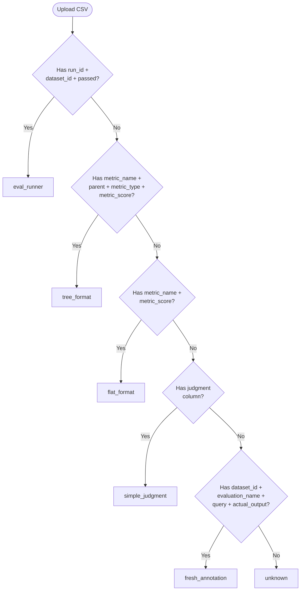
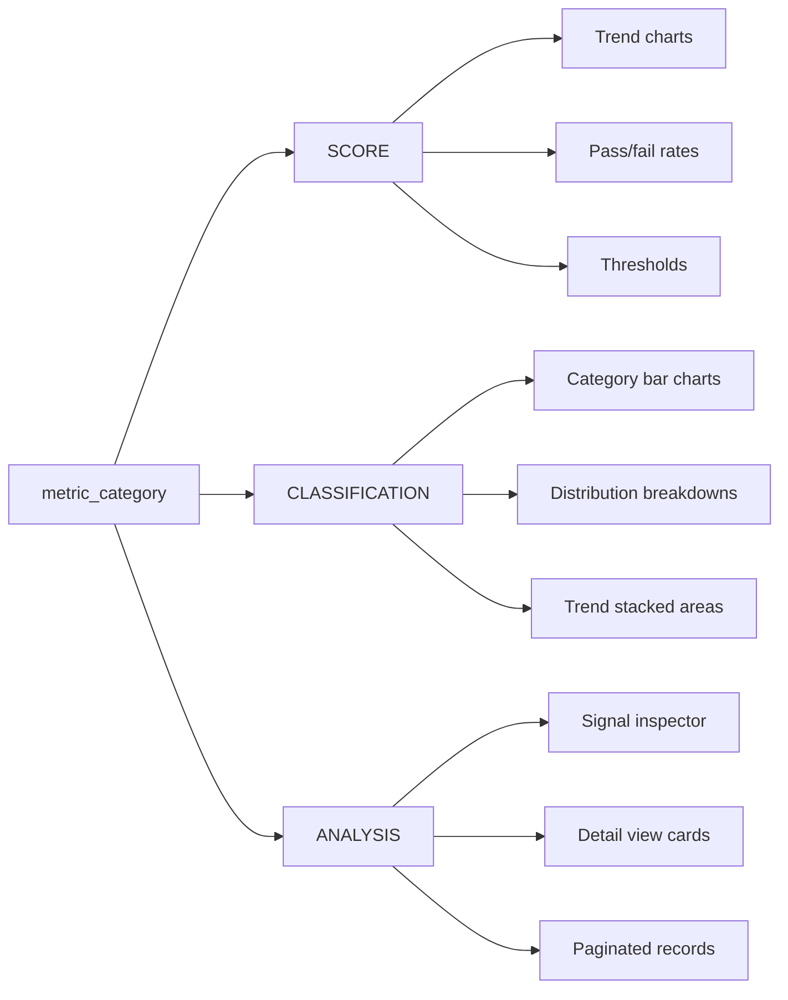

# Data Formats

AXIS supports multiple data formats for evaluation results and production monitoring. The backend automatically detects the format on upload and normalizes column names to a standard schema.

## Evaluation Formats

Evaluation data represents the results of running LLM evaluations. AXIS detects **five** formats, checked in priority order:

| Format              | Key Columns                                        | Use Case                                |
|---------------------|----------------------------------------------------|-----------------------------------------|
| `eval_runner`       | `run_id`, `dataset_id`, `passed`                   | Output from AXIS evaluation runner      |
| `tree_format`       | `metric_name`, `parent`, `metric_type`, `metric_score` | Hierarchical metrics with parent relationships |
| `flat_format`       | `metric_name`, `metric_score`                      | Simple metric scores in long format     |
| `simple_judgment`   | `judgment`                                         | Binary pass/fail judgments              |
| `fresh_annotation`  | `dataset_id`, `evaluation_name`, `query`, `actual_output` | Raw outputs ready for human annotation |

### Format Detection Flow

The backend's `detect_data_format()` function checks for formats in a strict priority order. The first match wins:



### Tree Format Example

Hierarchical metrics where each row is a single metric observation with parent-child relationships:

```csv
dataset_id,query,actual_output,metric_name,metric_score,metric_type,parent,weight,explanation
REC-001,What is AI?,AI is...,Overall Quality,0.82,metric,,1.0,
REC-001,What is AI?,AI is...,Faithfulness,0.90,component,Overall Quality,0.5,Accurate statements
REC-001,What is AI?,AI is...,Relevance,0.74,component,Overall Quality,0.5,Mostly relevant
```

### Flat Format Example

Simple long-format scores without hierarchy:

```csv
dataset_id,query,actual_output,metric_name,metric_score,explanation
REC-001,What is AI?,AI is...,Faithfulness,0.90,Accurate statements
REC-001,What is AI?,AI is...,Relevance,0.74,Mostly relevant
REC-002,Explain ML,ML is...,Faithfulness,0.85,Good accuracy
```

### Simple Judgment Example

Binary pass/fail evaluations:

```csv
dataset_id,query,actual_output,judgment
REC-001,What is AI?,AI is...,pass
REC-002,Explain ML,ML is...,fail
```

## Monitoring Formats

Monitoring data represents **time-series observations** from production systems. Two formats are supported:

### Long Format (Recommended)

Each row represents a **single metric observation**. Detected when data has both `metric_name` and `metric_score` columns.

```csv
dataset_id,query,actual_output,metric_name,metric_score,metric_category,timestamp,environment,source_name
01KFX,What is...,The answer,Faithfulness,0.85,SCORE,2024-01-15T10:30:00,production,my_agent
01KFX,What is...,The answer,Relevance,0.92,SCORE,2024-01-15T10:30:00,production,my_agent
01KFX,What is...,The answer,Topic,RELEVANT,CLASSIFICATION,2024-01-15T10:30:00,production,my_agent
```

!!! tip "When to use long format"
    Long format is the recommended format for production monitoring. It maps naturally to normalized database schemas and supports mixed metric categories per record.

### Wide Format

Each row contains **all metrics as separate columns**. Columns ending in `_score` are auto-detected as metrics.

```csv
dataset_id,query,actual_output,faithfulness_score,relevance_score,timestamp
01KFX,What is...,The answer,0.85,0.92,2024-01-15T10:30:00
```

### Metric Detection Logic

```python
def detect_metric_columns(df):
    # Long format: metric_name + metric_score columns present
    if "metric_name" in df.columns and "metric_score" in df.columns:
        return ["metric_score"]

    # Wide format: columns ending with _score
    return [col for col in df.columns if col.endswith("_score")]
```

## Column Normalization

The monitoring upload automatically normalizes common column name variations. The normalization is case-insensitive and replaces spaces/hyphens with underscores before lookup.

### Normalization Map

=== "Identifiers"

    | Input Alias      | Normalized To  |
    |------------------|----------------|
    | `id`             | `dataset_id`   |
    | `record_id`      | `dataset_id`   |
    | `dataset_id`     | `dataset_id`   |

=== "Timestamps"

    | Input Alias      | Normalized To  |
    |------------------|----------------|
    | `time`           | `timestamp`    |
    | `created_at`     | `timestamp`    |
    | `dataset_created_at` | `timestamp`|

=== "Input / Output"

    | Input Alias      | Normalized To  |
    |------------------|----------------|
    | `input`          | `query`        |
    | `prompt`         | `query`        |
    | `user_input`     | `query`        |
    | `output`         | `actual_output`|
    | `response`       | `actual_output`|
    | `model_output`   | `actual_output`|
    | `completion`     | `actual_output`|

=== "Model / Agent"

    | Input Alias      | Normalized To  |
    |------------------|----------------|
    | `model`          | `model_name`   |
    | `agent`          | `model_name`   |
    | `agent_name`     | `model_name`   |

=== "Environment"

    | Input Alias      | Normalized To  |
    |------------------|----------------|
    | `env`            | `environment`  |
    | `stage`          | `environment`  |

=== "Performance"

    | Input Alias      | Normalized To  |
    |------------------|----------------|
    | `latency_ms`     | `latency`      |
    | `response_time`  | `latency`      |
    | `error`          | `has_errors`   |

!!! note "Custom column mappings"
    When loading from a database via YAML config, you can specify a `columns` map that takes precedence over the default normalization. This allows mapping arbitrary column names to the standard schema.

## Metric Categories

Each metric in the monitoring long format can have a `metric_category` that determines how the metric output is interpreted and displayed:

| Category          | Value Type   | Display                                     | Example Output            |
|-------------------|-------------|----------------------------------------------|---------------------------|
| `SCORE`           | Numeric (0-1)| Charts, thresholds, pass/fail, trend lines  | `0.85`, `0.92`            |
| `CLASSIFICATION`  | String       | Category breakdowns, distribution bar charts | `"RELEVANT"`, `"POSITIVE"` |
| `ANALYSIS`        | JSON / Text  | Structured detail views, signal inspectors   | `{"issues": [...], "summary": "..."}` |



If `metric_category` is not provided, the metric defaults to `SCORE`.

## Shared Constants

Column names, thresholds, and colors are defined in both the Python backend and the TypeScript frontend to keep them in sync.

=== "Python (backend/app/config.py)"

    ```python
    class Columns:
        DATASET_ID = "dataset_id"
        QUERY = "query"
        ACTUAL_OUTPUT = "actual_output"
        METRIC_NAME = "metric_name"
        METRIC_SCORE = "metric_score"
        METRIC_CATEGORY = "metric_category"
        TIMESTAMP = "timestamp"
        # ... 40+ constants

    @dataclass(frozen=True)
    class Thresholds:
        PASSING_RATE: float = 0.5
        GREEN_THRESHOLD: float = 0.7
        RED_THRESHOLD: float = 0.3

    @dataclass(frozen=True)
    class Colors:
        PALETTE = {
            "primary": "#8B9F4F",
            "success": "#27AE60",
            "warning": "#F39C12",
            "error": "#E74C3C",
        }
    ```

=== "TypeScript (frontend/src/types/index.ts)"

    ```typescript
    export const Columns = {
      DATASET_ID: 'dataset_id',
      QUERY: 'query',
      ACTUAL_OUTPUT: 'actual_output',
      METRIC_NAME: 'metric_name',
      METRIC_SCORE: 'metric_score',
      METRIC_CATEGORY: 'metric_category',
      TIMESTAMP: 'timestamp',
      // ... 40+ constants
    } as const;

    export const Thresholds = {
      PASSING_RATE: 0.5,
      GREEN_THRESHOLD: 0.7,
      RED_THRESHOLD: 0.3,
    } as const;

    export const DefaultColors = {
      primary: '#8B9F4F',
      success: '#27AE60',
      warning: '#F39C12',
      error: '#E74C3C',
    } as const;
    ```

!!! warning "Keep in sync"
    When adding or renaming a column constant, update **both** `backend/app/config.py` and `frontend/src/types/index.ts`. There is no code generation step -- these are maintained manually.

## Monitoring Column Reference

Complete reference of standard monitoring columns:

| Column              | Required | Type     | Description                                    |
|---------------------|:--------:|----------|------------------------------------------------|
| `dataset_id`        | Yes      | string   | Unique identifier for the record               |
| `timestamp`         | No*      | datetime | ISO datetime; auto-generated if missing        |
| `query`             | No       | string   | Input/prompt text                              |
| `actual_output`     | No       | string   | LLM response text                              |
| `expected_output`   | No       | string   | Ground truth for comparison                    |
| `metric_name`       | No       | string   | Metric name (long format)                      |
| `metric_score`      | No       | number   | Metric value (long format)                     |
| `metric_type`       | No       | string   | Type of metric (`component`, `aggregate`)      |
| `metric_category`   | No       | string   | Output type: `SCORE`, `CLASSIFICATION`, `ANALYSIS` |
| `environment`       | No       | string   | Deployment environment (e.g., `production`)    |
| `source_name`       | No       | string   | Agent or source system name (e.g., `alpha_bot`)  |
| `source_component`  | No       | string   | Component within source (e.g., `retrieval`)    |
| `source_type`       | No       | string   | Source type (e.g., `langfuse`, `custom`)       |
| `evaluation_name`   | No       | string   | Name of the evaluation/experiment              |
| `model_name`        | No       | string   | Model used for generation                      |
| `trace_id`          | No       | string   | Observability trace ID                         |
| `latency`           | No       | number   | Response time in milliseconds                  |
| `passed`            | No       | boolean  | Whether the metric passed its threshold        |
| `threshold`         | No       | number   | Pass/fail threshold value                      |
| `explanation`       | No       | string   | Metric explanation text                        |
| `signals`           | No       | JSON     | Structured evaluation signals                  |

*Timestamp is auto-generated with the current time if not present in the uploaded data.

## Human Signals Formats

The Human Signals (HITL) dashboard supports two data versions:

### V1 Format

Case-level records with fixed columns like `Case_ID`, `Business`, `Has_Intervention`, `Intervention_Type`, `Sentiment`, `Final_Outcome`, etc. This is a hardcoded schema.

### V2 Format (Data-Driven)

Generic signal records where metrics are flattened as `{metric_name}__{signal_key}` columns. The backend auto-discovers the schema and returns:

- `metric_schema`: Describes discovered metrics, their categories, and signal types
- `display_config`: YAML-driven layout for KPIs, charts, filters, and table columns

The frontend auto-detects V1 vs V2 based on the presence of `metric_schema` in the upload response.
