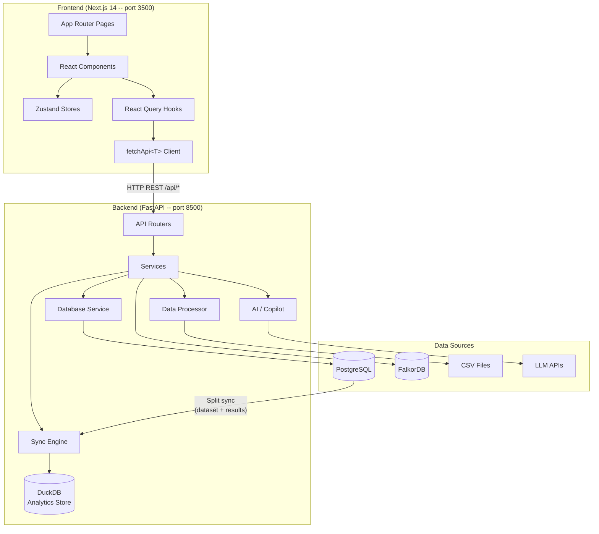
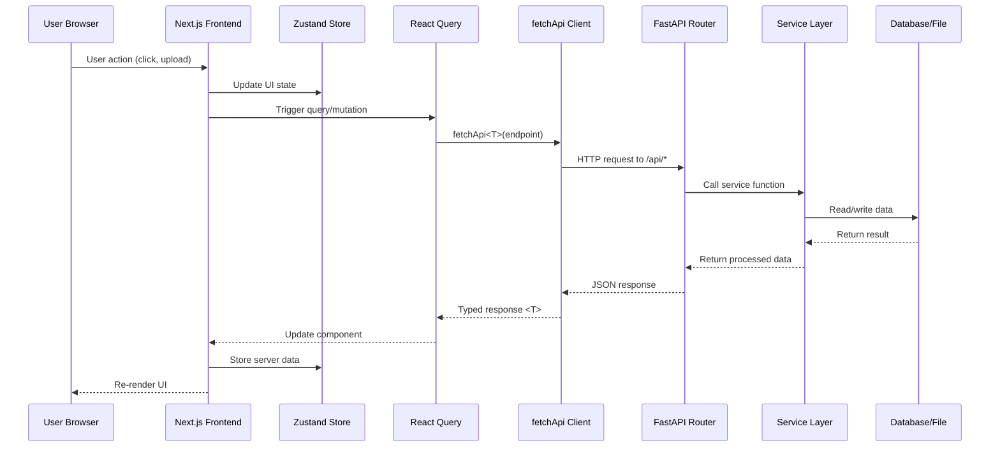

# Architecture Overview

AXIS uses a **split architecture** with a Next.js 14 frontend and a FastAPI backend communicating over HTTP REST APIs. Both services run independently and can be deployed together or separately.

## System Diagram



## Tech Stack

### Frontend

| Category           | Technology               | Version   |
|--------------------|--------------------------|-----------|
| Framework          | Next.js (App Router)     | 14.2      |
| Language           | TypeScript               | 5.6       |
| Styling            | Tailwind CSS             | 3.4       |
| State Management   | Zustand                  | 5.0       |
| Data Fetching      | TanStack React Query     | 5.60      |
| Charts             | Plotly.js / react-plotly  | 2.35      |
| Graph Viz          | D3.js                    | 7.9       |
| Icons              | Lucide React             | 0.460     |

### Backend

| Category           | Technology               | Version   |
|--------------------|--------------------------|-----------|
| Framework          | FastAPI                  | 0.115+    |
| Language           | Python                   | 3.12+     |
| Data Processing    | Pandas / NumPy           | Latest    |
| Schemas            | Pydantic / pydantic-settings | 2.0+  |
| Database           | SQLAlchemy + asyncpg      | 2.0+     |
| Analytics Store    | DuckDB                   | 1.1+      |
| Graph DB           | FalkorDB (Redis protocol) | Latest   |
| Linting            | Ruff                     | Latest    |

## Port Assignments

| Service       | Default Port | Environment Variable       |
|---------------|:------------:|----------------------------|
| Frontend      | **3500**     | (next.config.js)           |
| Backend API   | **8500**     | `PORT` in `.env`           |
| PostgreSQL    | 5432         | `*_db_port` in `.env`      |
| FalkorDB      | 6379         | `graph_db_port` in `.env`  |

## Directory Structure

```
axis/
├── backend/
│   ├── app/
│   │   ├── main.py              # FastAPI entry point
│   │   ├── config.py            # Settings, Columns, Thresholds, Colors
│   │   ├── routers/             # 14 API routers
│   │   ├── services/            # Business logic layer
│   │   ├── models/              # Pydantic schemas
│   │   └── copilot/             # AI copilot agent + skills
│   ├── config/                  # YAML config files (.example templates tracked)
│   │   ├── human_signals_db.yaml # Human Signals DB: split queries, incremental sync
│   │   ├── monitoring_db.yaml   # Monitoring DB: split queries, incremental sync
│   │   ├── eval_db.yaml         # Eval DB: split queries
│   │   ├── duckdb.yaml          # DuckDB store: sync mode, workers, concurrency
│   │   ├── theme.yaml           # Color palettes and branding
│   │   ├── agents.yaml          # Agent registry
│   │   └── signals_metrics.yaml # Signals dashboard display overrides
│   ├── data/                    # DuckDB database file
│   │   └── local_store.duckdb
│   └── .env                     # Environment variables
│
├── frontend/
│   ├── src/
│   │   ├── app/                 # Next.js App Router pages
│   │   ├── components/          # React components (by feature)
│   │   ├── stores/              # Zustand state stores
│   │   ├── lib/                 # API client, hooks, utilities
│   │   └── types/               # TypeScript type definitions
│   ├── public/                  # Static assets
│   └── .env.local               # Frontend environment variables
│
└── docs/                        # MkDocs documentation site
```

## Request Flow

A typical request flows through these layers:



## Communication Protocol

- **Transport**: HTTP/1.1 REST over JSON
- **Streaming**: Server-Sent Events (SSE) for AI copilot and eval runner progress
- **CORS**: Frontend origin explicitly allowed in backend middleware
- **Authentication**: None (designed for internal/local deployment)
- **Error format**: `{ "detail": "error message" }` with appropriate HTTP status codes

## Next Steps

- [Backend Architecture](backend.md) -- routers, services, and configuration
- [DuckDB Analytics Store](duckdb-store.md) -- embedded analytics engine and sync pipeline
- [Frontend Architecture](frontend.md) -- pages, components, and patterns
- [Data Formats](data-formats.md) -- evaluation and monitoring data specs
- [State Management](state-management.md) -- Zustand stores and React Query
