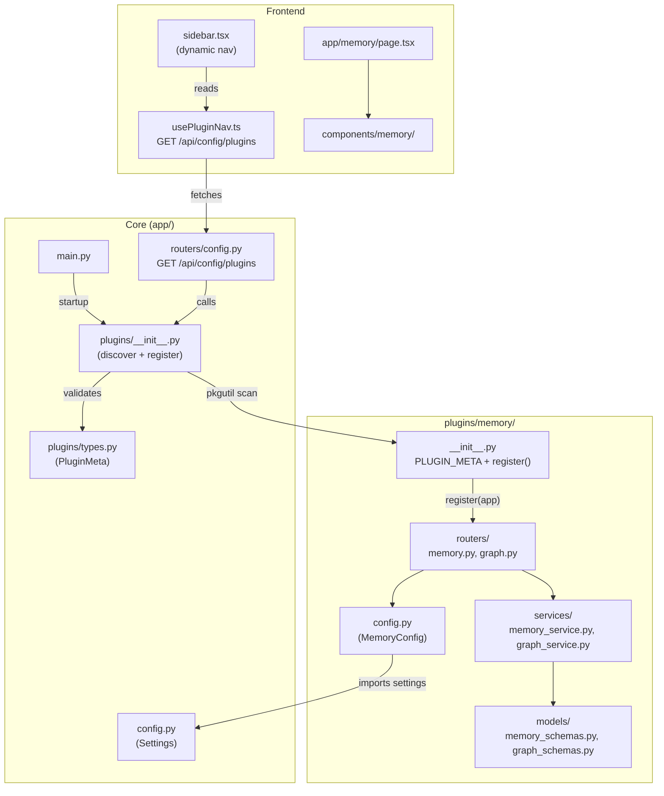
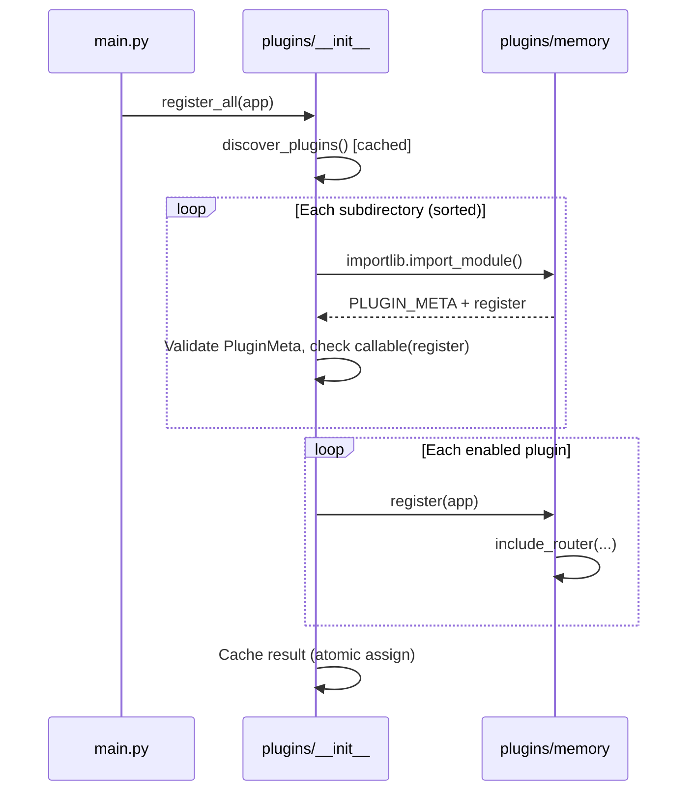

# Plugin System

AXIS uses a lightweight plugin system to organize feature modules as self-contained packages. Each plugin owns its routers, services, models, and config — the framework discovers and registers them automatically at startup. Removing a plugin is as simple as deleting its directory.

## Architecture



## Plugin Contract

Every plugin is a Python package inside `backend/app/plugins/`. The loader expects two things in the package's `__init__.py`:

| Export | Type | Purpose |
|--------|------|---------|
| `PLUGIN_META` | `PluginMeta` | Static metadata: name, version, nav items, OpenAPI tags |
| `register(app)` | `Callable[[FastAPI], None]` | Registers routers on the FastAPI app instance |

The module body should contain **only** these two items. All other imports happen inside `register()` to keep discovery cheap and side-effect-free.

```python title="plugins/memory/__init__.py"
from fastapi import FastAPI

from app.plugins.types import PluginMeta, PluginNavItem, PluginTagMeta

PLUGIN_META = PluginMeta(
    name="memory",
    version="0.1.0",
    description="Decision memory rules, hard stops, and batch analysis",
    nav=[
        PluginNavItem(name="Memory", href="/memory", icon="Brain", section="main", order=50),
    ],
    tags_metadata=[
        PluginTagMeta(name="memory", description="Decision memory rules and batch analysis"),
        PluginTagMeta(name="graph", description="Knowledge graph queries (FalkorDB)"),
    ],
)

def register(app: FastAPI) -> None:
    from .routers.graph import router as graph_router
    from .routers.memory import router as memory_router

    app.include_router(memory_router, prefix="/api/memory", tags=["memory"])
    app.include_router(graph_router, prefix="/api/memory/graph", tags=["graph"])
```

### Agent Replay Plugin

The Agent Replay plugin shows a more complex pattern — it integrates with an external service (Langfuse) and an optional search database:

```python title="plugins/agent_replay/__init__.py"
from fastapi import FastAPI

from app.plugins.types import PluginMeta, PluginNavItem, PluginTagMeta

PLUGIN_META = PluginMeta(
    name="agent_replay",
    version="0.1.0",
    description="Step through AI agent workflows from Langfuse",
    nav=[
        PluginNavItem(
            name="Agent Replay",
            href="/agent-replay",
            icon="PlayCircle",
            section="main",
            order=45,
        ),
    ],
    tags_metadata=[
        PluginTagMeta(
            name="agent-replay",
            description="Agent workflow replay from Langfuse traces",
        ),
    ],
)

def register(app: FastAPI) -> None:
    from .routers.replay import router as replay_router

    app.include_router(replay_router, prefix="/api/agent-replay", tags=["agent-replay"])
```

```
backend/app/plugins/
└── agent_replay/
    ├── __init__.py              # PLUGIN_META + register()
    ├── config.py                # ReplayConfig, ReplayDBConfig, LangfuseAgentCreds
    ├── routers/
    │   └── replay.py            # /api/agent-replay/* endpoints
    ├── services/
    │   ├── replay_service.py    # Langfuse trace fetching, tree building
    │   └── search_db.py         # PostgreSQL business-field → trace-ID lookup
    └── models/
        └── replay_schemas.py    # Pydantic request/response models
```

Key differences from the Memory plugin:

- **External service dependency** — Langfuse credentials are discovered from `LANGFUSE_*` env vars at config load time, not from YAML
- **Optional database** — The search DB (`agent_replay_db.yaml`) is optional; trace ID search works without it
- **Per-agent overrides** — Both Langfuse credentials and DB table/column mappings can vary per agent

## Metadata Models

Plugin metadata is defined as typed Pydantic models in `plugins/types.py`:

```python
class PluginNavItem(BaseModel):
    name: str           # Display name in sidebar
    href: str           # Next.js route path
    icon: str           # Lucide icon name (e.g. "Brain")
    section: str        # "main" or "tools"
    order: int = 50     # Sort key (lower = higher in list)

class PluginTagMeta(BaseModel):
    name: str           # OpenAPI tag name
    description: str = ""

class PluginMeta(BaseModel):
    name: str
    api_version: int = 1
    version: str = "0.1.0"
    description: str = ""
    nav: list[PluginNavItem] = Field(default_factory=list)
    tags_metadata: list[PluginTagMeta] = Field(default_factory=list)
```

`api_version` allows the contract to evolve without silent breakage. `nav` and `tags_metadata` use `Field(default_factory=list)` to avoid the mutable default footgun.

## Discovery and Registration

The plugin loader in `plugins/__init__.py` uses `pkgutil.iter_modules` to scan subdirectories. Discovery is **deterministic** — module names are sorted alphabetically before importing.



### Failure Isolation

Each plugin's discovery and `register()` call is individually wrapped in `try/except`. A broken plugin logs `logger.error(...)` and is skipped — the app still starts. The error surfaces in the `/api/config/plugins` endpoint.

### Conflict Policy

- **OpenAPI tags**: Deduplicated by `name`, first wins (core tags before plugin tags, plugins in alphabetical order). Sorted by name for stable output.
- **Nav items**: Deduplicated by `href`, first wins. Sorted by `(order, name)`.

## Enable / Disable

The `AXIS_PLUGINS_ENABLED` setting in `app/config/env.py` controls which plugins are active:

| Value | Effect |
|-------|--------|
| `"*"` (default) | All discovered plugins are enabled |
| `"memory,other"` | Only named plugins are enabled |
| `""` (empty) | All plugins disabled |

Disabled plugins are still listed in `/api/config/plugins` with `enabled: false` but their `register()` is never called.

Set it via environment variable or in the Settings class:

```bash
AXIS_PLUGINS_ENABLED="memory" uvicorn app.main:app
```

## Plugin Directory Structure

```
backend/app/plugins/
├── __init__.py                  # Plugin loader (discover, register, tags, nav)
├── types.py                     # PluginMeta, PluginNavItem, PluginTagMeta
└── memory/
    ├── __init__.py              # PLUGIN_META + register()
    ├── config.py                # MemoryConfig, MemoryFieldRoles, load_memory_config()
    ├── routers/
    │   ├── __init__.py
    │   ├── memory.py            # /api/memory/* endpoints
    │   └── graph.py             # /api/memory/graph/* endpoints
    ├── services/
    │   ├── __init__.py
    │   ├── memory_service.py    # Rule parsing, CSV loading, CRUD
    │   └── graph_service.py     # FalkorDB graph queries
    └── models/
        ├── __init__.py
        ├── memory_schemas.py    # Memory Pydantic schemas
        └── graph_schemas.py     # Graph Pydantic schemas
```

## API Endpoint

`GET /api/config/plugins` returns all discovered plugins (including disabled ones):

```json
{
  "plugins": [
    {
      "name": "memory",
      "version": "0.1.0",
      "api_version": 1,
      "description": "Decision memory rules, hard stops, and batch analysis",
      "nav": [
        {
          "name": "Memory",
          "href": "/memory",
          "icon": "Brain",
          "section": "main",
          "order": 50
        }
      ],
      "enabled": true,
      "error": null
    }
  ]
}
```

The `error` field is `null` for healthy plugins or a string describing the failure (e.g., `"no PLUGIN_META"`, `"register failed"`).

## Frontend Integration

### Dynamic Sidebar

The sidebar fetches plugin data via the `usePluginNav` hook and merges plugin nav items into the navigation:

```typescript
const { data: pluginData } = usePluginNav();

const pluginMainNav = (pluginData?.plugins ?? [])
  .filter((p) => p.enabled)
  .flatMap((p) => p.nav)
  .filter((n) => n.section === 'main')
  .map((n) => ({ name: n.name, href: n.href, icon: resolveIcon(n.icon) }));

const mainNav = [...coreMainNav, ...pluginMainNav];
```

### Icon Resolution

A `Record<string, LucideIcon>` maps icon names from the plugin API to Lucide components. Unknown names fall back to `LayoutGrid` and log a warning in development:

```typescript
const iconMap: Record<string, LucideIcon> = { Brain };

const resolveIcon = (name: string): LucideIcon => {
  const icon = iconMap[name];
  if (!icon && process.env.NODE_ENV === 'development') {
    console.warn(`[plugins] Unknown icon "${name}", using fallback`);
  }
  return icon ?? LayoutGrid;
};
```

Add new icon mappings to `iconMap` as plugins are created.

### Hydration Safety

The plugin query is prefetched on `QueryClient` creation in `providers.tsx` with `staleTime: Infinity`. This means the sidebar usually has plugin data on first render. If the API is slow, core nav renders immediately and plugin items appear when ready.

## Creating a New Plugin

1. Create a package directory under `backend/app/plugins/`:

    ```
    plugins/my_feature/
    ├── __init__.py
    ├── routers/
    │   └── __init__.py
    ├── services/
    │   └── __init__.py
    └── models/
        └── __init__.py
    ```

2. Define `PLUGIN_META` and `register()` in `__init__.py`:

    ```python
    from fastapi import FastAPI
    from app.plugins.types import PluginMeta, PluginNavItem, PluginTagMeta

    PLUGIN_META = PluginMeta(
        name="my_feature",
        version="0.1.0",
        description="What this plugin does",
        nav=[PluginNavItem(name="My Feature", href="/my-feature", icon="Sparkles", section="tools", order=60)],
        tags_metadata=[PluginTagMeta(name="my-feature", description="My feature endpoints")],
    )

    def register(app: FastAPI) -> None:
        from .routers.my_router import router
        app.include_router(router, prefix="/api/my-feature", tags=["my-feature"])
    ```

3. Add the icon name to `iconMap` in `sidebar.tsx`:

    ```typescript
    import { Brain, Sparkles } from 'lucide-react';
    const iconMap: Record<string, LucideIcon> = { Brain, Sparkles };
    ```

4. Create the Next.js page at `frontend/src/app/my-feature/page.tsx`.

5. Restart the backend — the plugin is automatically discovered and registered.

## Key Design Decisions

### Why Not Entry Points / setuptools?

Entry points (`pkg_resources` / `importlib.metadata`) are designed for installed third-party packages. AXIS plugins are first-party code in the same repo — `pkgutil.iter_modules` is simpler, faster, and requires no packaging machinery.

### Why Module-Level Cache?

`discover_plugins()` caches its result after first call. Plugin discovery involves importing every plugin module and validating metadata, which should only happen once. The cache is assigned atomically (single `=` statement) to avoid partial population under concurrency.

### Why Deprecation Proxy Instead of Redirect?

When the `/api/config/memory` endpoint moved to `/api/memory/config`, a deprecation proxy was added instead of a 307 redirect. Some HTTP clients and scripts don't follow redirects by default. The proxy returns the same JSON payload plus deprecation headers (`Deprecation: true`, `Sunset`, `Link`) and an extra `_deprecated` field in the body.
