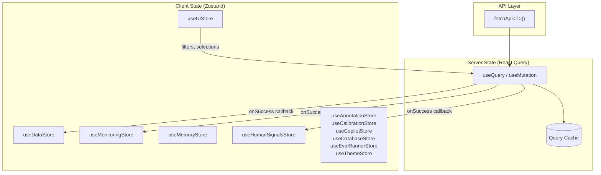
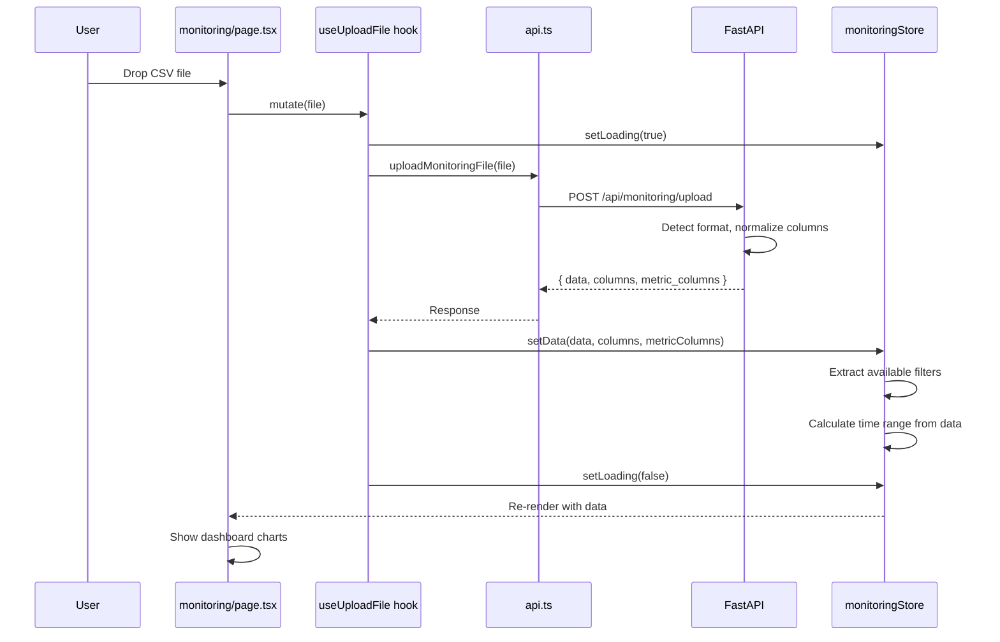

# State Management

The AXIS frontend uses **Zustand** for client-side state and **React Query** (TanStack Query) for server-side data fetching. These two layers serve different purposes and interact through a predictable pattern.

## Architecture Overview



## Zustand Stores

All stores are barrel-exported from `src/stores/index.ts`:

```typescript
export { useDataStore } from './data-store';
export { useUIStore } from './ui-store';
export { useAnnotationStore } from './annotation-store';
export { useCalibrationStore } from './calibration-store';
export { useCopilotStore } from './copilot-store';
export { useDatabaseStore } from './database-store';
export { useMonitoringStore } from './monitoring-store';
export { useEvalRunnerStore } from './eval-runner-store';
export { useThemeStore } from './theme-store';
export { useMemoryStore } from './memory-store';
export { useHumanSignalsStore } from './human-signals-store';
```

### Store Creation Pattern

All stores follow the same Zustand pattern:

```typescript
import { create } from 'zustand';
import { persist } from 'zustand/middleware';  // optional

interface SomeState {
  // State fields
  data: SomeRecord[];
  isLoading: boolean;
  error: string | null;

  // Actions
  setData: (data: SomeRecord[]) => void;
  setLoading: (loading: boolean) => void;
  clearData: () => void;
}

export const useSomeStore = create<SomeState>()((set) => ({
  data: [],
  isLoading: false,
  error: null,

  setData: (data) => set({ data, isLoading: false, error: null }),
  setLoading: (isLoading) => set({ isLoading }),
  clearData: () => set({ data: [], isLoading: false, error: null }),
}));
```

!!! note "Persist middleware"
    Stores that hold UI preferences (like `ui-store` and `monitoring-store`) use Zustand's `persist` middleware to save state to `localStorage`. Data stores typically do not persist.

### Store Reference

#### ui-store

The largest store, managing all UI preferences, filter selections, and modal state. Uses `persist` middleware.

| State Group          | Key Fields                                           |
|----------------------|------------------------------------------------------|
| Layout               | `sidebarCollapsed`, `copilotOpen`, `theme`           |
| Evaluation filters   | `selectedExperiment`, `selectedExperiments`, `selectedMetrics` |
| Pagination           | `currentPage`, `itemsPerPage`, `viewMode`            |
| Tab state            | `visualizeSubTab`, `learnMainTab`, `compareChartType` |
| Modals               | `testCaseDetailModalOpen`, `selectedCompareTestCaseId` |
| Report config        | `reportMode`, `reportType`, `reportContextFields`   |
| Annotation config    | `annotationScoreMode`, `annotationFilter`, `customTags` |

#### data-store

Manages evaluation data loaded from CSV uploads or database imports. Uses `persist`.

| Field            | Type                | Description                        |
|------------------|---------------------|------------------------------------|
| `data`           | `EvaluationRecord[]`| Raw evaluation records             |
| `format`         | `DataFormat`        | Detected format type               |
| `columns`        | `string[]`          | All column names                   |
| `metricColumns`  | `string[]`          | Columns containing numeric metrics |
| `componentColumns` | `string[]`        | Component-level metric columns     |
| `summary`        | `MetricSummary[]`   | Computed metric statistics         |
| `isLoading`      | `boolean`           | Upload in progress                 |
| `error`          | `string \| null`    | Error message                      |

#### monitoring-store

Manages monitoring/observability data with time-series filtering. Uses `persist`.

| Field                    | Type                        | Description                      |
|--------------------------|-----------------------------|----------------------------------|
| `data`                   | `MonitoringRecord[]`        | Raw monitoring records           |
| `format`                 | `'monitoring' \| null`      | Always `'monitoring'` when loaded|
| `metricColumns`          | `string[]`                  | `['metric_score']` for long format |
| `timeRange`              | `MonitoringTimeRange`       | Active time range with presets   |
| `selectedEnvironment`    | `string`                    | Filter by environment            |
| `selectedSourceName`     | `string`                    | Filter by source system          |
| `selectedSourceComponent`| `string`                    | Filter by component              |
| `selectedSourceType`     | `string`                    | Filter by source type            |
| `activeMetricTab`        | `MetricCategoryTab`         | Active tab (score, classification, analysis) |
| `chartGranularity`       | `MonitoringChartGranularity`| Hourly, daily, or weekly         |

Time range presets: `1h`, `6h`, `24h`, `7d`, `30d`, `custom`.

#### memory-store

Manages memory rule data for the Memory dashboard. Does **not** persist.

| Field              | Type                    | Description                      |
|--------------------|-------------------------|----------------------------------|
| `data`             | `MemoryRuleRecord[]`    | Loaded memory rules              |
| `summary`          | `MemorySummary`         | Aggregate counts                 |
| `filtersAvailable` | `MemoryFiltersAvailable`| Unique filter values             |
| `activeTab`        | `MemoryTab`             | Active tab (rules, quality, hard-stops, batches, knowledge-graph) |
| `filters`          | `MemoryFilters`         | Active filter selections         |
| `graphSearchQuery` | `string`                | Knowledge graph search input     |
| `selectedNodeId`   | `string \| null`        | Selected graph node              |

#### human-signals-store

Manages Human Signals (HITL) data. Uses `persist`.

| Field                | Type                      | Description                        |
|----------------------|---------------------------|------------------------------------|
| `cases`              | `SignalsCaseRecord[]`     | Case records                       |
| `format`             | `SignalsDataFormat`       | `'hitl_feedback_v2'`               |
| `metricSchema`       | `SignalsMetricSchema`     | Auto-discovered metric schema      |
| `displayConfig`      | `SignalsDisplayConfig`    | YAML-driven display layout         |
| `selectedSourceName` | `string`                  | Source filter                      |
| `selectedMetricFilters` | `Record<string, string>`| Per-metric signal filters          |
| `timeRange`          | `SignalsTimeRange`        | Time range with presets            |

Time range presets: `7d`, `30d`, `90d`, `6m`, `1y`, `custom`.

#### Other Stores

| Store                 | Purpose                                         |
|-----------------------|-------------------------------------------------|
| `annotation-store`    | Human annotation scores, tags, and undo history |
| `calibration-store`   | LLM judge calibration state                     |
| `copilot-store`       | AI copilot messages and thought stream          |
| `database-store`      | Database connection wizard step state           |
| `eval-runner-store`   | Evaluation runner workflow state and progress   |
| `theme-store`         | Active theme palette loaded from backend        |

## React Query Hooks

React Query hooks live in `src/lib/hooks.ts` and wrap API calls from `src/lib/api.ts`. They handle loading states, caching, and store updates.

### Mutation Pattern (Uploads)

Mutations are used for data uploads and actions that modify server state:

```typescript
export function useUploadFile() {
  const queryClient = useQueryClient();
  const { setData, setLoading, setError } = useDataStore();

  return useMutation({
    mutationFn: api.uploadFile,
    onMutate: () => {
      setLoading(true);
    },
    onSuccess: (response) => {
      setData(
        response.data as EvaluationRecord[],
        response.format as DataFormat,
        response.columns
      );
      queryClient.invalidateQueries({ queryKey: ['summary'] });
    },
    onError: (error) => {
      setError(error.message);
    },
    onSettled: () => {
      setLoading(false);
    },
  });
}
```

Key points:

1. `onMutate` sets the loading state in the Zustand store
2. `onSuccess` populates the store with response data
3. Related queries are invalidated to trigger refetches
4. `onSettled` clears loading regardless of outcome

### Query Pattern (Analytics)

Queries are used for derived computations that depend on uploaded data:

```typescript
export function useSummaryStats(data: EvaluationRecord[]) {
  return useQuery({
    queryKey: ['summary', data.length],
    queryFn: () => api.getSummaryStats(data),
    enabled: data.length > 0,  // Only fetch when data exists
  });
}
```

Key points:

1. `queryKey` includes data length for cache invalidation
2. `enabled` prevents unnecessary fetches when no data is loaded
3. The query sends data to the backend for server-side computation

## fetchApi Client

The centralized API client in `src/lib/api.ts`:

```typescript
const API_BASE_URL = process.env.NEXT_PUBLIC_API_URL || 'http://localhost:8500';

async function fetchApi<T>(endpoint: string, options: RequestInit = {}): Promise<T> {
  const url = `${API_BASE_URL}${endpoint}`;

  const response = await fetch(url, {
    ...options,
    headers: {
      'Content-Type': 'application/json',
      ...options.headers,
    },
  });

  if (!response.ok) {
    const error = await response.json().catch(() => ({}));
    throw new Error(error.detail || `API error: ${response.status}`);
  }

  return response.json();
}
```

Features:

- **Generic type parameter** `<T>` for typed responses
- **Automatic JSON headers** on all requests
- **Error extraction** from FastAPI's `{ "detail": "..." }` format
- **Connection error handling** with helpful message when backend is unreachable

### File Uploads

File uploads bypass `fetchApi` because they use `FormData` instead of JSON:

```typescript
export async function uploadFile(file: File): Promise<UploadResponse> {
  const formData = new FormData();
  formData.append('file', file);

  const response = await fetch(`${API_BASE_URL}/api/data/upload`, {
    method: 'POST',
    body: formData,
    // No Content-Type header -- browser sets multipart boundary
  });

  if (!response.ok) {
    const error = await response.json().catch(() => ({}));
    throw new Error(error.detail || 'Upload failed');
  }

  return response.json();
}
```

## Data Flow: Upload to Dashboard

Here is the complete flow when a user uploads a monitoring CSV:



## Store Interaction Patterns

### Cross-Store Reads

Components can read from multiple stores simultaneously:

```typescript
export function ProductionPage() {
  const { data: evalData } = useDataStore();
  const { data: monitoringData } = useMonitoringStore();
  const { cases: signalsCases } = useHumanSignalsStore();
  // Combine data from all stores for the production overview
}
```

### Filter-Driven Re-renders

Monitoring filters in the store drive chart re-computation:

```typescript
export function TrendsChart() {
  const { data, selectedEnvironment, selectedSourceName, chartGranularity }
    = useMonitoringStore();

  const filteredData = useMemo(() => {
    return data.filter(r =>
      (!selectedEnvironment || r.environment === selectedEnvironment) &&
      (!selectedSourceName || r.source_name === selectedSourceName)
    );
  }, [data, selectedEnvironment, selectedSourceName]);

  // Pass filteredData to chart rendering
}
```

### Pagination Reset Pattern

Stores that support filtering reset pagination when filters change:

```typescript
useEffect(() => {
  setCurrentPage(1);
}, [filters.action, filters.product_type, filters.risk_category]);
```

This ensures users always see page 1 when filter criteria change.
