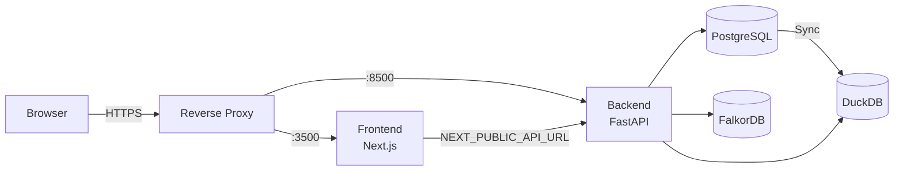

# Deployment

AXIS ships as a monorepo with two independently deployable services:

| Service | Runtime | Default Port | Image Base |
|---------|---------|--------------|------------|
| **Frontend** | Next.js 14 (standalone) | 3500 | `node:20-alpine` |
| **Backend** | FastAPI + Uvicorn | 8500 | `python:3.12-slim` |

Both services include production-ready Dockerfiles and a `docker-compose.yml` for local orchestration. For production, you typically place a reverse proxy in front of the two containers to handle TLS termination, compression, and path-based routing.

---

## Deployment Options

| Approach | Best For | Complexity |
|----------|----------|------------|
| **Docker Compose** | Local dev, staging, single-server | Low |
| **Container orchestrator** (K8s, ECS, Cloud Run) | Production, auto-scaling | Medium--High |
| **Bare-metal / VM** | Air-gapped environments | Medium |

---

## Architecture at a Glance

The frontend calls the backend via `NEXT_PUBLIC_API_URL`. The backend reads `FRONTEND_URL` to configure its CORS allow-list. PostgreSQL data is synced into a local DuckDB file that serves all analytics queries. All other secrets (API keys, database credentials) live exclusively in the backend runtime environment.

---

## Quick Links

-   :material-docker:{ .lg .middle } **Docker**

    ---

    Run AXIS locally with Docker Compose or build production images.

    [:octicons-arrow-right-24: Docker guide](docker.md)

-   :material-server:{ .lg .middle } **Production**

    ---

    Reverse proxy setup, health checks, scaling, and database configuration.

    [:octicons-arrow-right-24: Production guide](production.md)

-   :material-shield-lock:{ .lg .middle } **Security**

    ---

    Secrets management, CORS, frontend exposure risks, and hardening tips.

    [:octicons-arrow-right-24: Security notes](security.md)

-   :material-database-sync:{ .lg .middle } **DuckDB Sync Runbook**

    ---

    Split sync, incremental refresh, periodic scheduler, and watermark management for PostgreSQL -> DuckDB.

    [:octicons-arrow-right-24: Sync runbook](duckdb-sync-runbook.md)

---

## Deployment Checklist

Use this as a final gate before going live:

- [ ] Frontend `NEXT_PUBLIC_API_URL` points to the production backend
- [ ] Backend `FRONTEND_URL` (and optional `FRONTEND_URLS`) matches frontend origins
- [ ] All secrets (API keys, DB passwords) exist only in backend runtime env
- [ ] `DEBUG=false` is set on the backend
- [ ] Backend runs Uvicorn **without** `--reload`
- [ ] YAML auto-load configs (`custom/config/*.yaml`) are present in the image or mounted (controlled by `AXIS_CUSTOM_DIR` in containers)
- [ ] DuckDB config (`custom/config/duckdb.yaml`) is present with `sync_mode: "startup"`
- [ ] Persistent volume mounted at `backend/data/` for DuckDB file
- [ ] Monitoring sync pattern defined (split queries + incremental refresh via `incremental_column`)
- [ ] Periodic sync configured (`refresh_interval_minutes > 0`) or external scheduler wired
- [ ] Health checks (`GET /health`) are wired into your orchestrator
- [ ] TLS is terminated at the reverse proxy or load balancer
- [ ] `.env` files are excluded from the container image (`.dockerignore`)
