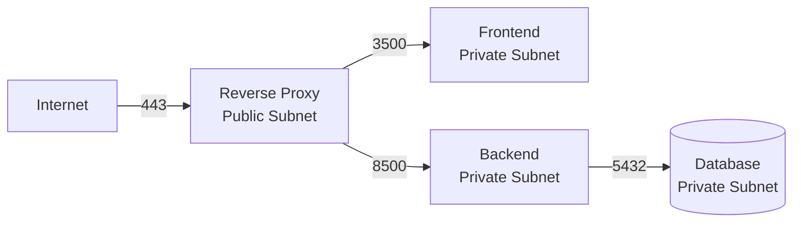

# Security

This page covers security best practices for deploying AXIS. While AXIS is designed as an internal evaluation tool, following these guidelines protects your data, credentials, and infrastructure.

---

## Secrets Management

### Never commit `.env` files

The `.env` file contains API keys, database passwords, and other credentials. It is git-ignored by default, but verify your `.gitignore` includes:

```gitignore
.env
.env.local
.env.*.local
backend/.env
frontend/.env.local
```

!!! danger "Audit before pushing"
    Run `git diff --cached --name-only` before every commit to ensure no `.env` file is staged. If a secret has been committed, rotate the affected credentials immediately -- removing the file from history is not sufficient.

### Frontend environment variables are public

Any variable prefixed with `NEXT_PUBLIC_` is embedded into the JavaScript bundle at build time and is **visible to every user** who opens the browser DevTools.

| Safe for `NEXT_PUBLIC_*` | NOT safe for `NEXT_PUBLIC_*` |
|--------------------------|------------------------------|
| Backend URL | API keys (OpenAI, Anthropic) |
| Feature flags | Database passwords |
| Public app name | Internal service tokens |

```env title="frontend/.env.local -- correct"
# This is the ONLY frontend env var AXIS needs
NEXT_PUBLIC_API_URL=https://api.your-domain.com
```

!!! warning "No secrets in the frontend"
    Never place `OPENAI_API_KEY`, `ANTHROPIC_API_KEY`, database credentials, or any other secret in a `NEXT_PUBLIC_*` variable. These belong exclusively in the backend `.env` file.

### Rotate keys regularly

- Rotate LLM API keys (OpenAI, Anthropic) on a regular cadence
- Rotate database passwords when team members leave
- Use short-lived credentials where your infrastructure supports them (e.g., IAM database auth on AWS)

### Use a secrets manager in production

For production deployments, inject secrets via your platform's secrets manager rather than `.env` files:

| Platform | Secrets Solution |
|----------|-----------------|
| AWS | Secrets Manager or SSM Parameter Store |
| GCP | Secret Manager |
| Azure | Key Vault |
| Kubernetes | Secrets (with encryption at rest) |
| Docker Compose | `docker secret` or `env_file` with restricted permissions |

---

## CORS Configuration

The backend uses FastAPI's CORS middleware. By default, it allows three origins:

```python
allow_origins=[
    "http://localhost:3500",       # Local dev
    "http://127.0.0.1:3500",      # Local dev (alt)
    settings.FRONTEND_URL,         # Configured origin
]
```

### Production CORS checklist

- [ ] Set `FRONTEND_URL` to your exact production frontend origin (including scheme and port if non-standard)
- [ ] Do not use `*` as a wildcard origin in production
- [ ] If you serve the frontend and backend on the same domain via a reverse proxy, CORS is not required -- but `FRONTEND_URL` should still be set correctly for consistency

!!! tip "Testing CORS"
    Open the browser console on your production frontend and check for CORS errors. The most common issue is a mismatch between the actual frontend origin and the value of `FRONTEND_URL` (e.g., trailing slash, wrong port, `http` vs `https`).

---

## Database Security

### Parameterized queries

AXIS uses [SQLAlchemy](https://www.sqlalchemy.org/) with parameterized queries for all database operations. SQL injection is mitigated by design -- table and column names are validated against the database schema before being used in queries.

### Connection security

| Setting | Recommended Value | Purpose |
|---------|-------------------|---------|
| `ssl_mode` | `require` | Encrypt data in transit |
| Connection timeout | 10 seconds (hardcoded) | Prevent hanging on unreachable hosts |
| Query timeout | 30--60 seconds (configurable) | Prevent runaway queries |
| Row limit | 10,000--50,000 (configurable) | Prevent memory exhaustion |

```yaml title="custom/config/eval_db.yaml"
eval_db:
  enabled: true
  ssl_mode: require
  query_timeout: 60
  row_limit: 50000
```

### Connection handles

The database integration module uses ephemeral connection handles with a **15-minute TTL**. After 15 minutes of inactivity, the handle expires and the user must reconnect. This limits the blast radius if a handle is leaked.

### Least privilege

Create a dedicated database user for AXIS with minimal permissions:

```sql
-- PostgreSQL example
CREATE USER axis_reader WITH PASSWORD 'strong-random-password';
GRANT CONNECT ON DATABASE axis_eval TO axis_reader;
GRANT USAGE ON SCHEMA public TO axis_reader;
GRANT SELECT ON ALL TABLES IN SCHEMA public TO axis_reader;
```

AXIS only reads data -- it never writes to your evaluation, monitoring, or human signals databases. A read-only user is sufficient.

---

## Network Security

### TLS everywhere

- Terminate TLS at your reverse proxy or load balancer
- Use `ssl_mode: require` for all PostgreSQL connections
- Use HTTPS URLs for `NEXT_PUBLIC_API_URL` and `FRONTEND_URL` in production

### Restrict network access

- The backend should only be reachable through the reverse proxy, not directly from the internet
- Database ports (5432 for PostgreSQL, 6379 for FalkorDB) should not be exposed to the internet
- Use private subnets or security groups to isolate the backend and database from public traffic



### Disable debug mode

In production, always set:

```env
DEBUG=false
```

Debug mode enables Uvicorn's auto-reload watcher and more verbose logging. It should never be active in a production deployment.

---

## Container Hardening

Both Dockerfiles follow container security best practices:

### Non-root users

| Image | User | UID |
|-------|------|-----|
| Frontend (`runner` stage) | `nextjs` | 1001 |
| Backend | `appuser` | 1000 |

### Minimal images

- The frontend production image (`runner` stage) contains only the standalone Next.js output -- no `node_modules`, no source code
- The backend image installs only production dependencies from `requirements.txt`

### Additional hardening

Consider these steps for high-security environments:

- [ ] Scan images for vulnerabilities with `docker scout`, Trivy, or Snyk
- [ ] Pin base image digests instead of tags (`node:20-alpine@sha256:...`)
- [ ] Set `read_only: true` in Compose to make the container filesystem read-only
- [ ] Drop all Linux capabilities: `cap_drop: [ALL]`
- [ ] Set `no-new-privileges: true` in the security options

---

## API Documentation Endpoint

The backend serves interactive API docs at `/docs` (Swagger UI) and `/redoc` (ReDoc). In production, you may want to restrict access to these endpoints:

=== "Reverse proxy restriction"

    Block public access in Nginx:

    ```nginx
    location /docs {
        allow 10.0.0.0/8;   # Internal network
        deny all;
    }
    location /redoc {
        allow 10.0.0.0/8;
        deny all;
    }
    location /openapi.json {
        allow 10.0.0.0/8;
        deny all;
    }
    ```

=== "Disable entirely"

    Set `docs_url=None` and `redoc_url=None` in `app/main.py`:

    ```python
    app = FastAPI(
        title="AXIS API",
        docs_url=None,
        redoc_url=None,
    )
    ```

---

## Summary of Production Settings

| Setting | Value | Notes |
|---------|-------|-------|
| `DEBUG` | `false` | Disables auto-reload and verbose logging |
| `FRONTEND_URL` | Exact production origin | No trailing slash, correct scheme |
| `ssl_mode` | `require` | For all database connections |
| Uvicorn `--reload` | Omitted | Never use in production |
| `.env` files | Git-ignored, never in images | Inject secrets at runtime |
| `NEXT_PUBLIC_*` | Only `NEXT_PUBLIC_API_URL` | No secrets in frontend env |
| Container user | Non-root | Both images run as unprivileged users |

---

## Related

- [Production](production.md) -- deployment architecture and health checks
- [Docker](docker.md) -- building and running container images
- [Environment Variables](../configuration/environment-variables.md) -- complete env var reference
