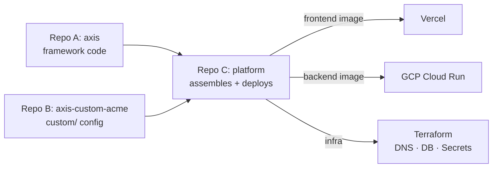

# Repository Model (Framework + Use-Case + Deploy)

AXIS supports multiple deployments (use-cases / customers) without forking or mixing proprietary configuration into the framework codebase.

This page defines a **3-repo model** and walks through exactly how to deploy each piece.

!!! note "Default recommendation"
    Use backend asset proxy URLs as the production contract:
    - `/api/config/assets/branding/<file>`
    - `/api/config/assets/agents/<file>`

    Keep `/branding/*` and `/agents/*` as local-dev convenience paths only.

---

## The three repos

| Repo | Example name | Contains | Visibility |
|------|-------------|----------|------------|
| **A — Framework** | `ax-foundry/axis` | All backend + frontend code, `.example` configs, docs | Public / open-source |
| **B — Use-case config** | `your-org/axis-custom-acme` | Only `custom/` — YAML configs, branding images, agent avatars | Private |
| **C — Deploy/Platform** | `your-org/acme-platform` | Terraform, Docker base images, GitHub Actions that assemble A + B and deploy | Private |



---

## Repo A — Framework (`axis`)

### What belongs here

- `backend/app/**` — FastAPI routers, services, models, copilot
- `frontend/src/**` — Next.js App Router, components, stores
- `backend/config/*.yaml.example` — config templates (tracked)
- `docs/**`, `mkdocs.yml` — documentation site
- `Makefile`, `scripts/**`, pre-commit config
- `custom/README.md` — documents the config contract (tracked)
- `backend/Dockerfile`, `frontend/Dockerfile` — build definitions

### What does NOT belong here

- Real YAML configs (`custom/config/*.yaml` is gitignored)
- Branding images or agent avatars
- Secrets (API keys, DB passwords)
- Terraform / CI / deployment workflows

### CI (runs on every PR to `master`)

```yaml
# .github/workflows/ci.yml — runs in Repo A
jobs:
  backend:
    steps:
      - ruff check app --fix && ruff format app
      - pytest
  frontend:
    steps:
      - npm run lint && npx tsc --noEmit
      - npm run build
  docs:
    steps:
      - mkdocs build --strict
```

---

## Repo B — Use-case config (`axis-custom-<name>`)

### Structure

```
axis-custom-acme/
├── config/
│   ├── theme.yaml              # Branding: app name, palette, hero image paths
│   ├── agents.yaml             # Agent registry (name, label, role, avatar)
│   ├── eval_db.yaml            # Eval DB connection + queries (no passwords)
│   ├── monitoring_db.yaml      # Monitoring thresholds, anomaly detection
│   ├── human_signals_db.yaml   # Human signals schema + visible metrics
│   ├── kpi_db.yaml             # KPI categories, display overrides
│   ├── duckdb.yaml             # Sync mode, chunk size, concurrency
│   ├── memory.yaml             # Memory field roles, action colors
│   ├── signals_metrics.yaml    # Signals dashboard display overrides
│   ├── agent_replay.yaml       # Langfuse defaults
│   └── agent_replay_db.yaml    # Per-agent table/column overrides
├── branding/
│   ├── hero.svg                # Hero background image
│   ├── favicon.ico             # Browser tab icon
│   ├── app-icon.ico            # Sidebar logo
│   └── logo.png                # (optional) header logo
├── agents/
│   ├── agent-alpha.ico         # Agent avatars
│   └── agent-beta.ico
└── README.md
```

### Rules

- **No credentials, ever.** Repo B must never contain passwords, API keys, tokens, or connection strings. YAML files set non-secret fields (`host`, `port`, `ssl_mode`, `query`, `table`, flags) and leave credential fields as `null` or omitted. Actual credentials are injected at runtime as env vars from GCP Secret Manager (backend) or Vercel project settings (frontend). If `grep -rE '(password|secret|key)\s*:' config/` matches a non-null value, the commit should be rejected.
- **No application code.** If you need custom behavior, it goes in Repo A behind a config flag.
- **No infrastructure.** Terraform, Docker, CI → Repo C.

### Example `theme.yaml`

```yaml
theme:
  active: "professional_blue"
  branding:
    app_name: "Acme Eval"
    tagline: "AI Quality for Acme"
    subtitle: "Acme Evaluation Studio"
    report_footer: "Report generated by Acme Eval"
    footer_name: "Acme"
  palettes:
    professional_blue:
      name: "Professional Blue"
      primary: "#3D5A80"
      primaryLight: "#5C7AA3"
      primaryDark: "#2B3C73"
      primarySoft: "#8BA4C4"
      primaryPale: "#C5D4E8"
      accentGold: "#D4AF37"
      accentSilver: "#B8C5D3"
      heroImage: "/api/config/assets/branding/hero.svg"
      faviconUrl: "/api/config/assets/branding/favicon.ico"
      appIconUrl: "/api/config/assets/branding/app-icon.ico"
      heroMode: "light"
      heroOpacity: 0.6
```

Image paths use `/api/config/assets/branding/*` — the backend serves these from `CUSTOM_DIR/branding/`. This works in both local dev (via Next.js rewrite) and production (via reverse proxy).

---

## Repo C — Deploy/Platform (`acme-platform`)

### What belongs here

- **Terraform**: DNS, TLS, Cloud Run services, databases, IAM, Secret Manager entries
- **Docker base images** (if any)
- **GitHub Actions workflows** that:
    1. Check out Repo A + Repo B
    2. Inject `custom/` into the framework workspace
    3. Build + push Docker images
    4. Deploy to Vercel / Cloud Run
- **Environment overlays**: per-environment variables (prod, staging)
- **Use-case selector**: which Repo B to deploy (a variable or input)

### What does NOT belong here

- Application code changes (→ Repo A)
- Raw secrets in plaintext (→ GCP Secret Manager, Vercel env vars)
- YAML configs (→ Repo B)

---

## Deploying the frontend (Vercel)

The frontend is **fully generic**. It has zero dependency on Repo B at build time — no branding images, no YAML configs, no agent avatars need to be present in the Vercel build workspace.

This works because:

- **Theme/branding text** is fetched at runtime via `GET /api/config/theme` (backend API)
- **Branding images** are served by the backend at `/api/config/assets/branding/{filename}` — the frontend never serves these from its own `public/` directory in production
- **Agent avatars** are served the same way at `/api/config/assets/agents/{filename}`
- `next.config.js` contains a rewrite rule that proxies `/api/*` requests to the backend, so image `src="/api/config/assets/branding/hero.svg"` works without the browser needing to know the backend URL

**There is no symlink or file-copy step needed for Vercel builds.** The `make setup` symlinks (`frontend/public/branding → custom/branding`) are a local dev convenience only.

### What Vercel needs

| Setting | Value | Where to set |
|---------|-------|-------------|
| `NEXT_PUBLIC_API_URL` | `https://api.acme.example.com` | Vercel project → Environment Variables |

That's it. One env var.

### How it works

1. Vercel builds the frontend from Repo A's `frontend/` directory (no Repo B checkout needed)
2. `NEXT_PUBLIC_API_URL` is baked into the JS bundle at build time
3. At runtime, the frontend fetches `/api/config/theme` from the backend to get branding, colors, and image paths
4. Image `src` attributes like `/api/config/assets/branding/hero.svg` are proxied to the backend via the Next.js rewrite rule in `next.config.js` — the browser never calls the backend directly for these

### Vercel project setup

Connect Vercel to **Repo A** (the framework repo):

- **Root directory**: `frontend`
- **Build command**: `npm run build`
- **Output directory**: `.next`
- **Install command**: `npm ci`

Or trigger deploys from Repo C's CI:

```bash
# In Repo C's GitHub Actions workflow
vercel deploy --prod \
  --token=$VERCEL_TOKEN \
  --env NEXT_PUBLIC_API_URL=https://api.acme.example.com
```

### Preview deployments

Every PR to Repo A gets a Vercel preview URL automatically. Since the frontend is generic, previews work against any backend — just set `NEXT_PUBLIC_API_URL` in the preview environment to point at a staging backend.

---

## Deploying the backend (GCP Cloud Run)

The backend image **includes** the use-case config. Repo C's CI assembles Repo A + Repo B, builds the image, and deploys it.

### Build pipeline (Repo C's GitHub Actions)

```yaml
# .github/workflows/deploy-backend.yml — lives in Repo C
name: Deploy Backend
on:
  push:
    branches: [main]
  workflow_dispatch:
    inputs:
      framework_ref:
        description: 'Framework repo ref (tag or SHA)'
        default: 'master'
      config_ref:
        description: 'Config repo ref (tag or SHA)'
        default: 'main'

env:
  REGION: us-central1
  PROJECT_ID: your-gcp-project
  SERVICE_NAME: axis-api
  IMAGE: us-central1-docker.pkg.dev/your-gcp-project/axis/api

jobs:
  build-deploy:
    runs-on: ubuntu-latest
    permissions:
      contents: read
      id-token: write  # For Workload Identity Federation

    steps:
      # 1. Check out Repo A (framework)
      - name: Checkout framework
        uses: actions/checkout@v4
        with:
          repository: ax-foundry/axis
          ref: ${{ inputs.framework_ref || 'master' }}
          path: axis

      # 2. Check out Repo B (use-case config)
      - name: Checkout config
        uses: actions/checkout@v4
        with:
          repository: your-org/axis-custom-acme
          ref: ${{ inputs.config_ref || 'main' }}
          path: config
          token: ${{ secrets.CONFIG_REPO_PAT }}

      # 3. Inject custom/ into framework workspace
      - name: Assemble workspace
        run: |
          cp -r config/config axis/backend/custom/config
          cp -r config/branding axis/backend/custom/branding
          cp -r config/agents axis/backend/custom/agents

      # 4. Authenticate to GCP
      - name: Auth to GCP
        uses: google-github-actions/auth@v2
        with:
          workload_identity_provider: ${{ secrets.WIF_PROVIDER }}
          service_account: ${{ secrets.WIF_SA }}

      # 5. Build + push Docker image
      - name: Build and push
        run: |
          gcloud auth configure-docker ${{ env.REGION }}-docker.pkg.dev --quiet
          docker build \
            -t ${{ env.IMAGE }}:${{ github.sha }} \
            -t ${{ env.IMAGE }}:latest \
            axis/backend
          docker push ${{ env.IMAGE }} --all-tags

      # 6. Deploy to Cloud Run
      - name: Deploy to Cloud Run
        run: |
          gcloud run deploy ${{ env.SERVICE_NAME }} \
            --image=${{ env.IMAGE }}:${{ github.sha }} \
            --region=${{ env.REGION }} \
            --platform=managed \
            --allow-unauthenticated \
            --set-env-vars="AXIS_CUSTOM_DIR=/app/custom,DEBUG=false" \
            --set-secrets="OPENAI_API_KEY=openai-api-key:latest,ANTHROPIC_API_KEY=anthropic-api-key:latest,EVAL_DB_URL=eval-db-url:latest,MONITORING_DB_URL=monitoring-db-url:latest" \  # pragma: allowlist secret
            --port=8500 \
            --memory=1Gi \
            --cpu=1 \
            --min-instances=0 \
            --max-instances=4
```

### What the Dockerfile does

```dockerfile
# backend/Dockerfile (lives in Repo A)
FROM python:3.12-slim
WORKDIR /app

COPY requirements.txt .
RUN pip install --no-cache-dir -r requirements.txt

COPY . .

# Ensure custom/ dirs exist (empty if no config injected)
RUN mkdir -p /app/custom/config /app/custom/branding /app/custom/agents
ENV AXIS_CUSTOM_DIR=/app/custom

RUN useradd -m -u 1000 appuser && chown -R appuser:appuser /app
USER appuser

EXPOSE 8500
CMD ["sh", "-c", "uvicorn app.main:app --host 0.0.0.0 --port ${PORT:-8500} --proxy-headers --forwarded-allow-ips='*'"]
```

The `COPY . .` picks up whatever is in the build context — including `custom/` if Repo C's pipeline placed it there. The `mkdir` ensures the build succeeds even without config (empty defaults).

### How branding images are served

The backend has an asset proxy endpoint:

```
GET /api/config/assets/branding/{filename}  → serves custom/branding/{filename}
GET /api/config/assets/agents/{filename}    → serves custom/agents/{filename}
```

Branding files get a 1-year immutable cache header. Agent avatars get a 24-hour cache. Path traversal is blocked.

---

## Secrets management

Secrets **never** live in Repo A or Repo B. They're injected at runtime from the deployment environment.

| Secret | Where it lives | How it's injected |
|--------|---------------|-------------------|
| `OPENAI_API_KEY` | GCP Secret Manager | `--set-secrets` in Cloud Run deploy |
| `ANTHROPIC_API_KEY` | GCP Secret Manager | `--set-secrets` in Cloud Run deploy |
| `EVAL_DB_URL` | GCP Secret Manager | `--set-secrets` in Cloud Run deploy |
| `MONITORING_DB_URL` | GCP Secret Manager | `--set-secrets` in Cloud Run deploy |
| `HUMAN_SIGNALS_DB_URL` | GCP Secret Manager | `--set-secrets` in Cloud Run deploy |
| `LANGFUSE_*_SECRET_KEY` | GCP Secret Manager | `--set-secrets` in Cloud Run deploy |
| `NEXT_PUBLIC_API_URL` | Vercel project settings | Build-time env var |

YAML config files in Repo B set connection details like `host`, `port`, `ssl_mode`, and `query` — but passwords stay `null`. The `url` field in env vars (from Secret Manager) takes precedence and provides the full connection string including credentials.

---

## Local development

### Framework-only (generic AXIS defaults)

```bash
git clone ax-foundry/axis && cd axis
make setup    # copies .example templates into custom/, creates symlinks
make dev      # starts backend + frontend + FalkorDB
```

This gives you AXIS with default branding and empty database connections. Good for developing features in Repo A.

### With use-case config

Clone both repos side by side and point AXIS at the config repo via env var:

```bash
git clone ax-foundry/axis && cd axis
git clone ax-foundry/axis-custom-acme ../axis-custom-acme

# Point AXIS at the config repo (absolute path)
export AXIS_CUSTOM_DIR=$(cd ../axis-custom-acme && pwd)

make dev
```

This is the recommended approach because:

- No nested `.git` directories (avoids tooling confusion, accidental commits to the wrong repo)
- No manual copy step — changes in `axis-custom-acme/` are picked up on backend restart
- `custom/` in the framework repo stays gitignored and empty

!!! tip "Persist the env var"
    Add `AXIS_CUSTOM_DIR=/absolute/path/to/axis-custom-acme` to your shell profile or a local `.envrc` (if using direnv) so you don't have to re-export it every session.

??? note "Alternative: copy into custom/"
    If you prefer a self-contained workspace, you can copy files instead:

    ```bash
    cp -r ../axis-custom-acme/config custom/config
    cp -r ../axis-custom-acme/branding custom/branding
    cp -r ../axis-custom-acme/agents custom/agents
    make dev
    ```

    Downside: you must re-copy after pulling config changes, and `custom/` now contains untracked files that could cause confusion with git.

### Docker Compose (local)

The `docker-compose.yml` in Repo A mounts `custom/` as a read-only volume:

```yaml
services:
  backend:
    environment:
      - AXIS_CUSTOM_DIR=/app/custom
    volumes:
      - ./custom:/app/custom:ro
```

If using Option A above, change the volume mount to point at the config repo:

```yaml
    volumes:
      - ../axis-custom-acme:/app/custom:ro
```

---

## Assembly patterns

### CI checkout (recommended)

Pipeline checks out both repos side by side and copies Repo B into Repo A's workspace. This is shown in the Cloud Run deploy workflow above.

**Pros**: Simple, explicit, no git submodule friction.
**Cons**: Requires a PAT or deploy key to access the private config repo.

### Git submodule

Repo C pins exact commits of A and B via submodules.

**Pros**: Reproducible — `git submodule update --init` gives you the exact versions.
**Cons**: Submodules add friction (forgotten updates, detached HEAD). Not worth it unless you need strict reproducibility.

### Bake vs. mount

| Approach | How | Best for |
|----------|-----|----------|
| **Bake into image** | CI copies `custom/` into build context before `docker build` | Cloud Run, ECS, any immutable deploy |
| **Volume mount** | Mount `custom/` at runtime via `-v` or k8s ConfigMap | Docker Compose, Kubernetes, when you want to change config without rebuilding |

**For Cloud Run + Vercel, bake into the image.** Cloud Run doesn't support volume mounts, so config must be in the image. This also makes deploys fully immutable — the image is the artifact.

---

## Versioning strategy

**Pin exact commits per environment.** This is not optional for production — you must be able to answer "what code and config is running right now?" and reproduce any deploy.

Repo C maintains a versions file (or workflow inputs) that pins both repos:

```yaml
# versions.yaml (in Repo C, or hardcoded in the workflow)
production:
  framework_ref: v1.2.0            # Repo A tag or SHA
  config_ref: v2024.02.23          # Repo B tag or SHA

staging:
  framework_ref: master            # Track latest for staging (acceptable)
  config_ref: main                 # Track latest for staging (acceptable)
```

### Deploy workflows

- **New framework version**: bump `framework_ref` in Repo C, push → CI rebuilds and deploys
- **Config change** (branding, thresholds, new agent): bump `config_ref` in Repo C, push → CI rebuilds and deploys
- **Both**: bump both in one commit

### Why pinning matters

Without pinning, a push to Repo A's `master` or Repo B's `main` could silently change what's running in production. Pinning ensures:

- Every deploy is an explicit, reviewable change in Repo C
- You can roll back by reverting a single commit
- Staging can track branches for fast iteration while production stays locked

---

## Related docs

- [Customization](../configuration/customization.md) — what goes in `custom/` and how it's loaded
- [Docker](../deployment/docker.md) — container workflow and `docker-compose.yml` reference
- [Production Deployment](../deployment/production.md) — reverse proxy, health checks, scaling
- [Environment Variables](../configuration/environment-variables.md) — complete env var reference
