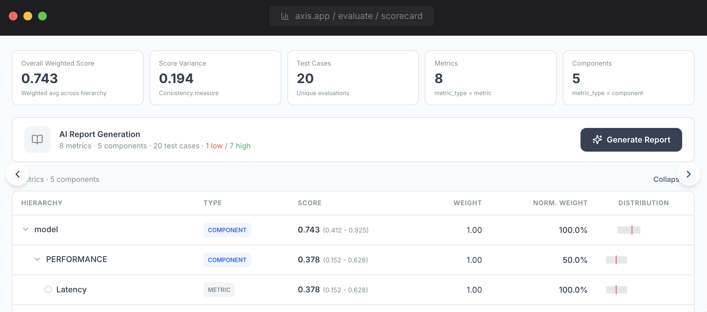
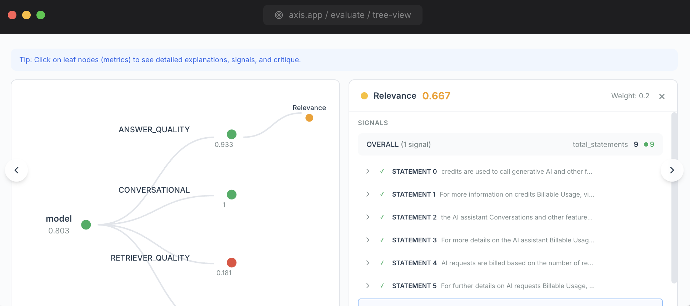

# AXIS

<figure markdown="span">
  { width="600" }
</figure>

**A**gent **X**-Ray **I**nterface & **S**tatistics

AXIS gives AI teams full visibility into model quality — from evaluation to production monitoring — so they can ship better models faster. Built as the visualization layer for the [AXION](https://github.com/ax-foundry/axion) evaluation engine, AXIS turns raw evaluation data into actionable insights through interactive dashboards, human-in-the-loop workflows, and real-time observability.

[:octicons-arrow-right-24: Get started](getting-started/installation.md){ .md-button .md-button--primary }
[:octicons-arrow-right-24: View on GitHub](https://github.com/ax-foundry/axis){ .md-button }

---

## Why AXIS?

<div class="feature-grid" markdown>

<div class="feature-card" markdown>

### :material-layers-outline: Comprehensive

11 integrated modules covering the full AI evaluation lifecycle — from batch evaluation and scoring to production monitoring, calibration, annotation, and decision memory.

</div>

<div class="feature-card" markdown>

### :material-cog-outline: Configurable

YAML-driven theming, agent registries, and data source configuration. Swap databases, customize branding, and extend functionality without touching code.

</div>

<div class="feature-card" markdown>

### :material-code-braces: Open & Extensible

Self-hosted, API-first architecture. FastAPI backend with auto-generated OpenAPI docs, Zustand stores for clean state management, and a modular component library.

</div>

</div>

---

## Platform Overview

<div class="screenshot-carousel" id="screenshot-carousel">
  <div class="carousel-track" id="carousel-track">
    <div class="carousel-slide">
      
    </div>
    <div class="carousel-slide">
      
    </div>
    <div class="carousel-slide">
      
    </div>
    <div class="carousel-slide">
      
    </div>
  </div>
  <button class="carousel-btn carousel-prev" aria-label="Previous">&#8249;</button>
  <button class="carousel-btn carousel-next" aria-label="Next">&#8250;</button>
  <div class="carousel-caption">
    <span class="caption-text">
      <span class="caption-label">Live</span>
      <span id="carousel-caption-text">Evaluation Scorecard</span>
    </span>
    <div class="carousel-dots" id="carousel-dots"></div>
  </div>
</div>

<div class="feature-grid" markdown>

<div class="feature-card" markdown>

### :material-chart-tree: Evaluate

Upload evaluation data, run batch evaluations, and explore results through interactive tree visualizations, analytics dashboards with 8+ chart types, and AI-generated reports with structured cross-metric pattern insights.

[:octicons-arrow-right-24: Learn more](user-guide/evaluate.md)

</div>

<div class="feature-card" markdown>

### :material-view-dashboard: Production

Executive overview combining Agent KPIs, AI quality monitoring, and human feedback signals in a single dashboard with sparkline trends.

[:octicons-arrow-right-24: Learn more](user-guide/production.md)

</div>

<div class="feature-card" markdown>

### :material-monitor-dashboard: Monitoring

Deep-dive production observability — time-series score trends, metric breakdowns, latency distributions, and anomaly alerts.

[:octicons-arrow-right-24: Learn more](user-guide/monitoring.md)

</div>

<div class="feature-card" markdown>

### :material-account-edit: Annotation

Human-in-the-loop quality assessment with 3 annotation formats, tag-based critiques, and CSV export.

[:octicons-arrow-right-24: Learn more](user-guide/annotation.md)

</div>

<div class="feature-card" markdown>

### :material-target: CaliberHQ

LLM judge calibration — 3-step workflow with annotation, EvidencePipeline-powered pattern discovery with learning insights, and alignment validation via Cohen's Kappa and confusion matrices.

[:octicons-arrow-right-24: Learn more](user-guide/calibration.md)

</div>

<div class="feature-card" markdown>

### :material-account-group: Simulation

Synthetic persona-based agent testing with configurable personas, knowledge base upload, and conversation replay.

[:octicons-arrow-right-24: Learn more](user-guide/simulation.md)

</div>

<div class="feature-card" markdown>

### :material-brain: Memory

Decision memory dashboard with rule extraction, hard stops, batch analysis, and knowledge graph visualization.

[:octicons-arrow-right-24: Learn more](user-guide/memory.md)

</div>

<div class="feature-card" markdown>

### :material-message-text: Human Signals

Data-driven HITL dashboard with dynamic KPI strips, signal trend charts, classification distributions, and case-level drill-down.

[:octicons-arrow-right-24: Learn more](user-guide/human-signals.md)

</div>

</div>

---

## Tech Stack

| Layer | Technologies |
|-------|-------------|
| **Frontend** | Next.js 14 (App Router), TypeScript, Tailwind CSS |
| **State** | Zustand, TanStack React Query |
| **Charts** | Plotly.js, D3.js |
| **Backend** | FastAPI, Python 3.12 |
| **Data** | Pandas, NumPy, Scikit-Learn |
| **Config** | Pydantic Settings, python-dotenv |

## Quick Start

```bash
# Clone and install
git clone https://github.com/ax-foundry/axis.git
cd axis
make install

# Start development servers
make dev
```

- **Frontend**: [http://localhost:3500](http://localhost:3500)
- **Backend**: [http://localhost:8500](http://localhost:8500)
- **API Docs**: [http://localhost:8500/docs](http://localhost:8500/docs)

[:octicons-arrow-right-24: Full installation guide](getting-started/installation.md)
